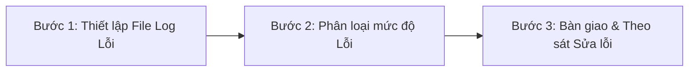

# 🧪 Playbook & Checklist: Quy trình QA & Testing Trang VIP Revamp

> **Mục tiêu:** Trang bị tư duy kiểm thử (QA know-how) và cung cấp checklist chi tiết các yếu tố cần Confirm & Cải tiến cho dự án VIP Revamp (Football Complex).
> **Dự án liên kết:** [project-brief.md](file:///c:/Users/VEE0678/Downloads/ws-default-career-twin/ws-default-career-twin/01_project_data/proj-vip-revamp/project-brief.md)

---

## 1. 🧠 Tư duy & Framework QA dành cho Product Specialist (Game Operator)

Là một người làm vận hành game (Game Ops/Product Specialist), anh không chỉ kiểm thử xem code có chạy được hay không (đó là việc của Tester chuyên nghiệp), mà anh cần kiểm thử dưới góc độ **Tính đúng đắn của logic nghiệp vụ** và **Trải nghiệm thực tế của người chơi**. 

Dưới đây là 4 tư duy và framework cốt lõi anh cần áp dụng:

### 1.1. Tư duy Biên (Boundary Value Testing)
Lỗi logic lập trình thường xuất hiện ở các **điểm biên**. Lập trình viên dễ viết nhầm dấu `>` thành `>=` hoặc ngược lại.
*   **Cách nghĩ:** Hãy tìm đúng mốc phân hạng và test ngay tại điểm nhạy cảm đó.
*   **Ví dụ:** Mốc nạp Silver là 600 FC+MC. Anh cần test:
    *   *Nạp 599 FC:* Hệ thống phải giữ nguyên hạng Bronze (dưới biên).
    *   *Nạp 600 FC:* Hệ thống phải nâng lên hạng Silver ngay lập tức (đúng biên).
    *   *Nạp 601 FC:* Hệ thống ở hạng Silver (trên biên).

### 1.2. Tư duy Phá hoại (Destructive Mindset)
Người dùng thực tế sẽ không đi theo luồng chuẩn mực mà Dev đã lập trình. Họ sẽ làm những hành động kỳ quặc nhất để nhận thêm quà hoặc làm sập web.
*   **Cách nghĩ:** Cố gắng làm gián đoạn luồng xử lý của hệ thống.
*   **Ví dụ:** 
    *   **Double-click/Spam:** Click liên tục vào nút "Nhận quà" để xem có nhận được 2 lần không (lỗi race condition).
    *   **Gián đoạn kết nối:** Đang bấm nhận quà thì reload trang, tắt mạng, hoặc chuyển từ Wifi sang 4G xem quà có bị mất hoặc bị lỗi giao diện không.
    *   **Chặn cookie/incognito:** Chạy thử trang web trên tab ẩn danh, chặn lưu cookie xem web có bắt đăng nhập liên tục không.

### 1.3. Tư duy Tương thích (Compatibility & Responsive Layout)
Người chơi FC Online dùng rất nhiều loại thiết bị để lướt web sự kiện (đặc biệt là điện thoại thông minh). Bản đồ Isometric 3D của trang VIP mới rất dễ bị vỡ khung hình hoặc quá tải phần cứng.
*   **Cách nghĩ:** Test trên nhiều độ phân giải màn hình và hệ điều hành.
*   **Ví dụ:**
    *   Test trên màn hình máy tính bàn (PC màn rộng 21:9, 16:9).
    *   Test trên các dòng iPhone (đặc biệt là tai thỏ/dynamic island xem có bị che mất nút đăng nhập/thông tin VIP không).
    *   Test trên các điện thoại Android giá rẻ để xem tốc độ render map có bị giật/lag không.

### 1.4. Tư duy Tích hợp Hệ thống (Integration Testing)
Trang VIP mới không đứng độc lập mà kết nối với 3 hệ thống khác:
1.  **Hệ thống Thanh toán (Garena Billing):** Nạp tiền in-game phải đồng bộ sang điểm VIP trên Web.
2.  **Dữ liệu In-game (Nexon Game Server):** Số trận đấu, ngày đăng nhập, thứ hạng leo rank phải được cào chính xác về Web.
3.  **Hòm thư In-game (In-game Mailbox):** Bấm nhận quà trên Web thì quà phải xuất hiện ở hòm thư trong game của tài khoản đó.
*   **Cách nghĩ:** Luôn kiểm tra điểm đầu và điểm cuối của dòng chảy dữ liệu.

---

## 2. 📋 Checklist QA VIP Revamp: Confirm & Cải thiện

Anh hãy sử dụng bảng checklist dưới đây để tiến hành test trực tiếp khi nhận staging:

### 2.1. Nhóm 1: Xác nhận Chức năng & Logic (Functional QA)

| ID | Hạng mục kiểm thử | Kịch bản kiểm thử (Test Case) | Kết quả kỳ vọng (Expected Outcome) | Điểm cần Confirm thêm |
| :---: | :--- | :--- | :--- | :--- |
| **FN-01** | Đồng bộ nạp tiền (Pay Track) | Nạp tiền (FC+MC) in-game và kiểm tra điểm VIP tích lũy tháng trên Web. | Điểm tăng đúng bằng số FC+MC đã nạp. Thời gian trễ (latency) đồng bộ dưới 5 phút. | *Hỏi Dev:* Tần suất cronjob đồng bộ điểm nạp từ Billing sang Web VIP là bao nhiêu phút/lần? |
| **FN-02** | Đồng bộ đá trận (Play Track) | Đá 1 trận trong game và kiểm tra số trận tích lũy của Play Zone trên Web. | Số trận tăng lên +1. | Trận đá máy (League) và đá xếp hạng (Ranked) có được tính như nhau không? Trận đấu giải giải lập (Manager) có tính không? |
| **FN-03** | Khấu trừ và Đổi quà | Click nút "Nhận quà" trên cây tích lũy (Pay/Play Tree). | Nút chuyển sang "Đã nhận", tài khoản in-game nhận đúng gói quà trong hòm thư. | Nếu hòm thư in-game bị đầy, hệ thống web xử lý thế nào? Có trả về lỗi hay giữ lại quà trên web? |
| **FN-04** | Cách tính Play Top 5 | Giả định dữ liệu top 5 Composite Score và xem kết quả phân hạng. | Lọc ra chính xác 5 tài khoản có score cao nhất nhận Legend Play visual. | Nếu điểm Composite Score bằng nhau ở vị trí số 5 và số 6, hệ thống ưu tiên tài khoản nào? (Ưu tiên người đạt mốc sớm hơn hay tính cả hai?) |
| **FN-05** | Reset Chu kỳ năm | Giả lập thời gian hệ thống chuyển giao sang ngày 01/01 năm sau. | Trạng thái SVIP/VVIP Tower chuyển sang "Legacy" (visual mờ + badge năm cũ). Điểm tích lũy năm reset về 0. | Các mốc quà trên Pay Tree & Play Tree có bị reset khi qua năm mới hay giữ nguyên trọn đời? |
| **FN-06** | Đồng nhất Multiplier | Rà soát cấu hình các gói quà trên Staging, so sánh giá trị tính toán với VLOOKUP từ `item value VN`. | Các gói cùng cấp gia cố (`+8`, `7~8`, `6~8`) được áp dụng đúng hệ số tiêu chuẩn (`0.5-0.6`, `0.4`, `0.3`) đồng nhất trên tất cả các tầng, không bị sai lệch. | Cần lập file checklist VLOOKUP tham chiếu chéo để kiểm tra tự động trước giờ go-live. |
| **FN-07** | Hiển thị Khoảng giá trị | Truy cập Web UI và kiểm tra phần hiển thị của các gói ngẫu nhiên (`6~8`, `7~8`). | Web UI hiển thị dạng Khoảng giá trị `[BP Min ~ BP Max]` thay vì ghi một con số đơn lẻ. | *Hỏi Dev:* API có trả về cả hai trường giá trị Min/Max của gói hay web phải tự VLOOKUP từ client? |

### 2.2. Nhóm 2: Trải nghiệm Giao diện & Tương thích (UI/UX & Mobile QA)

| ID | Hạng mục kiểm thử | Kịch bản kiểm thử (Test Case) | Kết quả kỳ vọng (Expected Outcome) | Gợi ý Cải tiến UX (Improvement) |
| :---: | :--- | :--- | :--- | :--- |
| **UI-01** | Tải trang Isometric Map | Truy cập trang web VIP bằng điện thoại cấu hình trung bình (Android/iOS cũ). | Bản đồ tải trong vòng < 3 giây. Animation công trình không bị giật, đứng hình. | **Đề xuất:** Thêm nút tắt/mở hiệu ứng chuyển động (Low FX Mode) để bảo vệ trải nghiệm của người dùng máy yếu. |
| **UI-02** | Progressive Reveal trên Mobile | Cuộn ngang/dọc cây quà (Pay/Play Tree) trên màn hình di động. | Chỉ hiển thị tối đa 3 mốc (Mốc hiện tại, mốc +1, mốc +2). Các mốc khác ẩn gọn gàng, không bị tràn màn hình. | **Đề xuất:** Thêm biểu tượng tooltip nhỏ ở mốc +2 hiển thị thông điệp gây tò mò (Ví dụ: *"Đạt mốc kế tiếp để khám phá"*). |
| **UI-03** | Hiển thị SVIP/VVIP Tower | Truy cập Complex Map của người chơi khác (chế độ Visit). | Nhìn thấy tòa tháp SVIP/VVIP nổi bật kèm đúng tên của chủ sở hữu. | **Đề xuất:** Cho phép chủ sở hữu tháp viết một dòng thông điệp ngắn (status) hiển thị khi người khác bấm vào tháp của họ để tăng tính "khoe thành tích". |
| **UI-04** | Sảnh Danh Vọng (Hall of Fame) | Mở bảng xếp hạng Top 100 nạp & Play. | Danh sách hiển thị căn lề thẳng, avatar và tên người chơi không bị lỗi font tiếng Việt. | **Đề xuất:** Thêm nút "Ghé thăm" (Visit) bên cạnh tên Top 1-10 để nhảy thẳng sang Complex của họ, tăng tính tương tác cộng đồng. |
| **UI-05** | Onboarding Hướng dẫn | Lần đầu tiên tài khoản mới đăng nhập vào web VIP. | Xuất hiện 1 Guided Tour ngắn (3-4 bước giải thích các khu vực Complex, Play Zone, Pay Zone và Cây quà). | **Đề xuất:** Hoàn thành Guided Tour sẽ tặng một món quà tân thủ nhỏ để tạo thiện cảm ban đầu (ví dụ: thẻ quà cỏ in-game). |

---

## 3. 📝 Các Bước Tiến Hành QA Thực Tế dành cho Coby

Khi dự án bước vào giai đoạn Test, anh hãy làm theo quy trình 3 bước sau:

### Bước 1: Thiết lập một File Google Sheet để log lỗi (Bug Report)
Tạo sheet có các cột:
1.  **ID:** Bug_001, Bug_002...
2.  **Hạng mục:** (Ví dụ: Pay Tree, VVIP Tower, Mobile UI...)
3.  **Mô tả lỗi:** (Ví dụ: *Bấm nhận quà mốc 10k trên iPhone 13 Pro Max bị đơ giao diện, không bấm được nữa*)
4.  **Các bước tái hiện (Steps to Reproduce):**
    *   *Bước 1: Đăng nhập tài khoản VIP.*
    *   *Bước 2: Click vào Pay Tree.*
    *   *Bước 3: Click nút Nhận quà mốc 10k.*
5.  **Mức độ nghiêm trọng (Severity):** Critical / Major / Minor.
6.  **Hình ảnh/Video minh họa (Evidence):** Chụp ảnh màn hình hoặc quay video lỗi.
7.  **Trạng thái (Status):** New -> In Progress -> Fixed -> Verified.

### Bước 2: Phân loại mức độ lỗi để bàn giao cho Dev
*   > [!CAUTION]
    > **CRITICAL (Nghiêm trọng):** Lỗi làm sập web, mất tài khoản, phát sai quà hoặc người chơi lợi dụng lỗi để nhận quà nhiều lần (exploit). *Lỗi này phải bắt Dev sửa ngay lập tức.*
*   > [!WARNING]
    > **MAJOR (Lớn):** Chức năng chạy sai logic (Ví dụ: nạp tiền đủ mốc nhưng không tăng điểm VIP, không mở được tháp SVIP khi đủ 1M). *Phải sửa trước khi launch.*
*   > [!NOTE]
    > **MINOR (Nhỏ/UX-UI):** Lệch chữ, vỡ layout nhẹ, animation hơi lag, thiếu tooltip. *Có thể sửa dần hoặc cập nhật sau khi launch ở dạng hotfix.*

### Bước 3: Follow-up hàng ngày
*   Mỗi ngày trước khi họp với anh Khôi (Supervisor) hoặc sync-up với anh Tú (Code Lead), hãy cập nhật trạng thái của file Google Sheet log lỗi này để toàn bộ team Dev/Design nắm được những gì đã fix và những gì còn tồn đọng.
