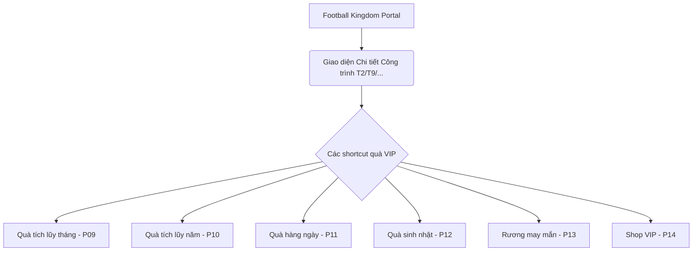

# 🎁 ĐỀ XUẤT CƠ CẤU QUÀ VIP REVAMP (REWARDS PROPOSAL)
> **Dự án:** FCO VIP Revamp (Football Complex)  
> **Chủ quản:** Nguyễn Ngọc Phúc - Coby (Strategy & Operations)  
> **Người duyệt:** Anh Trần Minh Khôi (PM FCO)  
> **Trạng thái:** Bản thảo đề xuất chi tiết (Draft Proposal) - Đã đồng bộ ý kiến PM & Wireframe  

---

## 📌 1. NGUYÊN TẮC THIẾT KẾ & ĐỊNH GIÁ QUÀ (REWARD VALUATION PRINCIPLES)

Nhằm đảm bảo cân bằng nền kinh tế trong game, tránh lạm phát chỉ số và quản lý tốt user sentiment (tránh khiếu nại về giá trị ảo trên TTCN), hệ thống quà áp dụng các nguyên tắc sau:
1.  **Hệ số chiết khấu chuẩn hóa (Discount Multipliers):**
    *   **Gói Chỉ định (+8):** Chiết khấu hệ số **`0.6`** (Bù đắp thuế chuyển nhượng và tính thanh khoản).
    *   **Gói Ngẫu nhiên hẹp (7~8):** Chiết khấu hệ số **`0.4`**.
    *   **Gói Ngẫu nhiên rộng (6~8):** Chiết khấu hệ số **`0.3`** (Do xác suất ra thẻ +6 chiếm trên 90%).
    *   **Các gói Jackpot / Siêu phẩm tỷ lệ thấp ($10^{-6}$):** Giữ nguyên hệ số **`1.0`** để tạo hiệu ứng truyền thông.
2.  **Chu kỳ làm mới (Refresh Cycle):** Định kỳ **3 - 6 tháng** sẽ refresh danh sách cầu thủ và quà tặng một lần để tạo sự hứng thú liên tục cho người chơi.
3.  **Công thức quy đổi giá trị:**
    *   Mốc quy đổi tiêu chuẩn: `1 FC/MC = 500 VND` (Quy đổi tiền nạp thật VND = Số FC / 2, ví dụ: 200 FC = 100k VND).
    *   Hệ số nạp khuyến mãi (x2, x3) vẫn được tính cộng dồn trực tiếp vào điểm tích lũy của cây.

---

## 📅 2. PHẦN 1: QUÀ VIP THEO THÁNG (MONTHLY REWARDS)

### A. Play Track (Hệ thống Chơi tích lũy tháng trước)
*Điểm Play tháng tính theo hoạt động chơi game. Quà Play tháng sẽ được trao vào ngày 1 hàng tháng dưới dạng Cúp gắn trên công trình PLAY tháng đó + Quà chuyển thẳng về kho.*

| Bậc Rank PLAY | Yêu cầu Điểm Play | Cúp Visual trên Map | Quà tặng Vật phẩm dự kiến (Monthly Item) |
| :---: | :---: | :---: | :--- |
| **Cấp 1 (Tân binh)** | $> 0$ điểm | ❌ Không có | Gói Hỗ trợ Tân thủ (200M BP + Thẻ VIP Active 3 ngày). |
| **Cấp 2 (Bán chuyên)** | $\ge 500$ điểm | 🥉 Cúp Đồng | Gói Bán Chuyên (500M BP + Gói cầu thủ Chỉ định (+3) các mùa thường). |
| **Cấp 3 (Chuyên nghiệp)**| $\ge 1,500$ điểm| 🥈 Cúp Bạc | Gói Chuyên Nghiệp (1B BP + Gói cầu thủ Chỉ định (+5) top 500). |
| **Cấp 4 (Thế giới)** | $\ge 3,500$ điểm| 🥇 Cúp Vàng | Gói Thế Giới (2.5B BP + Gói cầu thủ 7~8 các mùa hot + Sổ tay (notebook) tháng mới). |
| **Cấp 5 (Huyền thoại)** | $\ge 6,000$ điểm| 🏆 Cúp Bạch Kim | Gói Huyền Thoại (5B BP + Gói Chỉ định (+7) các mùa hot + Sổ tay tháng mới). |
| **Top 5 PLAY Server** | Top 5 điểm Play | 👑 Cúp MVP Đặc biệt | Gói Iron Man (10B BP + Thẻ cầu thủ Mùa đặc biệt **Infinity Prime (+5)** + 01 **Áo đấu FCO độc quyền** gửi về địa chỉ). |

---

### B. Pay Track (Hệ thống Nạp tích lũy tháng trước)
*Bậc rank PAY được gán dựa trên tổng nạp tháng liền trước. Các mốc nạp đã được điều chỉnh chuẩn theo công thức `VND = FC / 2` (tính bằng nghìn đồng).*

| Bậc Rank PAY | Yêu cầu Nạp Tháng (FC/MC) | Quy đổi VND | Visual Tòa nhà | Quà tặng VIP Month |
| :---: | :---: | :---: | :---: | :--- |
| **Mặc định** | $< 200$ FC | $< 100,000$ VND | Khung thép / Móng | Quà tích lũy nạp tối thiểu (50M BP). |
| **Đồng** | $\ge 200$ FC | $\ge 100,000$ VND | Móng nhà + Tường gạch | 200M BP + Gói chỉ định (+3). |
| **Bạc** | $\ge 600$ FC | $\ge 300,000$ VND | Khung nhà cơ bản | 600M BP + Gói chỉ định (+5) mùa thường. |
| **Vàng** | $\ge 1,500$ FC | $\ge 750,000$ VND | Tòa nhà hoàn chỉnh | 2B BP + Gói ngẫu nhiên (6~8) mùa hot. |
| **Bạch Kim** | $\ge 15,000$ FC | $\ge 7,500,000$ VND | Tòa nhà cao cấp | 10B BP + Gói ngẫu nhiên (7~8) + 1 Gói Phục hồi thể lực VIP. |
| **Kim Cương** | $\ge 50,000$ FC | $\ge 25,000,000$ VND | Tòa nhà phát sáng | 35B BP + Gói Chỉ định (+7) + Đặc quyền CS riêng. |
| **Whale (SVIP/VVIP)** | Tích lũy Năm Dương Lịch | Xem mục Yearly | Tòa tháp VIP động | Mở khóa đặc quyền Quà Năm, Lucky Box & VIP Shop |

---

## 🏆 3. PHẦN 2: CÂY TÍCH LŨY TRỌN ĐỜI & CHIA NHỎ CÁC KHOẢNG GAP (LIFETIME TREES)

### A. Pay Track (Cây Nạp tích lũy trọn đời - Smoothed Progression)
Để tránh việc người chơi nản lòng do khoảng cách nạp giữa các tier cũ quá xa (ví dụ từ 10 triệu vọt lên 50 triệu, 10 tỷ lên 50 tỷ), hệ thống mới chia nhỏ thành **30 Tầng tích lũy** với trần tối đa (Cap) là **100 Tỷ VND** (phù hợp với mức tích lũy cao nhất hiện nay của server là ~90 Tỷ VND).

*   **Tỷ lệ quy đổi điểm trên cây:** `1,000 VND = 1 Điểm Tích lũy`.
*   **Progressive Reveal:** Trên giao diện Pay Tree, người chơi sẽ nhìn thấy mốc hiện tại và mở mờ (faded) **2 mốc tiếp theo** để tạo động lực nạp phấn đấu.

| Tầng | Mốc Tích lũy (VND) | Điểm Tích lũy | Quà tặng Vật phẩm tích lũy trọn đời (Nhận 1 lần duy nhất) | Đặc quyền Visual trên Complex Map |
| :---: | :--- | :--- | :--- | :--- |
| **1** | $100,000$ VND | $100$ | 200M BP + Gói chỉ định (+3) | Khung móng Block đầu tiên |
| **2** | $300,000$ VND | $300$ | 500M BP + Gói chỉ định (+5) | Nâng cấp ngoại cảnh Central Plaza Lv1 |
| **3** | $500,000$ VND | $500$ | 1B BP + Gói chỉ định (+5) mùa hot | Thêm cây xanh ngoại cảnh |
| **4** | $1,000,000$ VND | $1,000$ | 2.5B BP + Gói ngẫu nhiên (6~8) | Khởi dựng Tòa nhà chính |
| **5** | $2,000,000$ VND | $2,000$ | 5B BP + Gói ngẫu nhiên (6~8) mùa hot | Nâng cấp ngoại cảnh Central Plaza Lv2 |
| **6** | $3,500,000$ VND | $3,500$ | 8B BP + Gói ngẫu nhiên (7~8) | Lát đường đá quanh tòa nhà |
| **7** | $5,000,000$ VND | $5,000$ | 12B BP + Gói ngẫu nhiên (7~8) mùa hot | Hoàn thiện thô tòa nhà chính |
| **8** | $7,500,000$ VND | $7,500$ | 18B BP + Gói Chỉ định (+7) | Lắp kính cường lực mặt tiền |
| **9** | $10,000,000$ VND | $10,000$ | 25B BP + Gói Chỉ định (+7) mùa hot | Thêm hệ thống đèn LED bao quanh |
| **10** | $15,000,000$ VND | $15,000$ | 38B BP + Gói ngẫu nhiên (7~8) top 300 | Nâng cấp ngoại cảnh Central Plaza Lv3 |
| **11** | $20,000,000$ VND | $20,000$ | 50B BP + Gói chỉ định (+7) top 200 | Mở khóa Banner thương hiệu Club |
| **12** | $30,000,000$ VND | $30,000$ | 80B BP + Gói chỉ định (+7) top 100 | Thêm đài phun nước mini |
| **13** | $50,000,000$ VND | $50,000$ | 130B BP + Gói Chỉ định (+8) | Mở khóa Block Đất Mới trên Map |
| **14** | $75,000,000$ VND | $75,000$ | 200B BP + Gói Chỉ định (+8) mùa hot | Nâng cấp ngoại cảnh Central Plaza Lv4 |
| **15** | $100,000,000$ VND| $100,000$ | 280B BP + Gói Chỉ định (+8) mùa đặc biệt | **Mở khóa SVIP Badge** in-game |
| **16** | $150,000,000$ VND| $150,000$ | 450B BP + Thẻ lựa chọn cầu thủ (+8) | Thêm thảm cỏ nhung cao cấp |
| **17** | $200,000,000$ VND| $200,000$ | 650B BP + Thẻ lựa chọn cầu thủ (+8) hot | Mở tháp **SVIP Tower** ở góc bản đồ |
| **18** | $300,000,000$ VND| $300,000$ | 1T BP + Thẻ VIP Premium (+8) | Tháp SVIP Tower phát sáng |
| **19** | $500,000,000$ VND| $500,000$ | 1.8T BP + Gói Chỉ định (+8) mùa đặc sắc | **Mở khóa VVIP Badge** in-game |
| **20** | $750,000,000$ VND| $750,000$ | 2.8T BP + Thẻ **Infinity Prime (+3)** | Thêm trực thăng đậu trên mái tháp |
| **21** | $1,000,000,000$ VND| $1,000,000$| 4T BP + Thẻ **Infinity Prime (+5)** | Mở tháp **VVIP Tower** (Tháp đôi đặc quyền) |
| **22** | $2,000,000,000$ VND| $2,000,000$| 9T BP + Custom Gói 3 cầu thủ hot (+8) | Cổng chào Complex dạng Neon phát sáng |
| **23** | $3,500,000,000$ VND| $3,500,000$| 16T BP + Custom Gói 5 cầu thủ hot (+8) | Nâng cấp ngoại cảnh Central Plaza Lv5 |
| **24** | $5,000,000,000$ VND| $5,000,000$| 24T BP + Gói Siêu phẩm Hoàng Gia (+8) | Custom thiết kế Sân vận động riêng trên Map |
| **25** | $7,500,000,000$ VND| $7,500,000$| 38T BP + Gói Huyền Thoại Bất Tử (+8) | Đèn pha Hologram quét trời Complex |
| **26** | $10,000,000,000$ VND| $10,000,000$| 55T BP + Custom Áo đấu in-game độc quyền | Mở khóa cổng **CSKH 1-1 VIP Manager** |
| **27** | $20,000,000,000$ VND| $20,000,000$| 120T BP + Custom Khung viền Avatar in-game | Tòa nhà chính đổi visual thành Cung Điện |
| **28** | $40,000,000,000$ VND| $40,000,000$| 260T BP + Gói Prime Legend 3 cầu thủ (+8)| Tượng đài Hologram 3D của HLV ở trung tâm |
| **29** | $75,000,000,000$ VND| $75,000,000$| 550T BP + Custom Thiết kế Badge riêng (theo yêu cầu) | Toàn bộ map phủ hiệu ứng hào quang vàng |
| **30 (CAP)**| $100,000,000,000$ VND| $100,000,000$| **1,000T (1 Quadrillion) BP** + Gói tối thượng | **Hall of Fame Legend Visual** (Kiến trúc vinh danh kỳ quan độc bản phát sáng toàn server) |

---

### B. Play Track (Cây Chơi tích lũy trọn đời - Cày chay cống hiến)
*Quy đổi hoạt động: 1 trận = 1 điểm, 1 ngày login = 10 điểm, 10 phút playtime = 1 điểm. Trần tích lũy tối đa: 1,000,000 điểm.*

| Tầng | Mốc Tích lũy (Điểm Play) | Gói Quà Cày Chay Trọn Đời (Nhận 1 lần duy nhất) | Nâng cấp Visual Central Plaza (Trang trí) |
| :---: | :---: | :--- | :--- |
| **1** | $1,000$ | 100M BP + Gói chỉ định (+3) | Trải cỏ phẳng cơ bản |
| **2** | $5,000$ | 600M BP + Gói chỉ định (+5) mùa thường | Central Plaza Lv1: Thêm lối đi lát đá |
| **3** | $10,000$ | 1.5B BP + Gói chỉ định (+5) mùa hot | Trồng thêm cây bóng mát quanh móng |
| **4** | $25,000$ | 4B BP + Gói ngẫu nhiên (6~8) | Central Plaza Lv2: Thêm ghế băng gỗ |
| **5** | $50,000$ | 9B BP + **Cày Chay Badge** hiển thị ingame | Lắp đài phun nước nhỏ |
| **6** | $100,000$ | 20B BP + Gói Chỉ định (+7) | Central Plaza Lv3: Đài phun nước 2 tầng |
| **7** | $250,000$ | 55B BP + Gói Chỉ định (+7) các mùa hot | Central Plaza Lv4: Tượng đài bóng đá |
| **8** | $500,000$ | 120B BP + Gói Chỉ định (+8) + **Play Legend Badge**| Central Plaza Lv5: Mái vòm pha lê |
| **9** | $750,000$ | 200B BP + Gói Lựa chọn cầu thủ (+8) | Thêm thảm cỏ hoa rực rỡ |
| **10 (CAP)**| $1,000,000$ | **300B BP** + Tượng đài đồng vinh danh HLV | Central Plaza Max: Tượng đồng HLV khổng lồ |

---

## 🗂️ 4. PHÂN TÍCH THÀNH PHẦN QUÀ THEO WIREFRAME DRAWIO
Dựa trên rà soát wireframe `Football_Kingdom_Wireframes_VI (1).drawio` (gồm 18 pages), dưới đây là danh sách các màn hình và phần quà cần soạn cụ thể:

### Chi tiết các gói quà cần soạn theo Wireframe:
1.  **Quà Tích Lũy Năm (Page `10_Reward_Yearly`):**
    *   *Nội dung:* Dành cho tháp đôi SVIP/VVIP Tower tích lũy theo năm dương lịch.
    *   *Mốc quà:* SVIP (1M FC+MC), VVIP (2M FC+MC).
    *   *Gói quà cần soạn:* Thẻ VVIP Year Pack, 500B BP, Gói chỉ định (+8) các mùa giải lớn của năm, Vé sự kiện VIP đặc quyền.
2.  **Quà Hàng Ngày (Page `11_Daily_Reward`):**
    *   *Nội dung:* Quà Mystery Box nhận mỗi ngày dựa trên cấp VIP tháng trước.
    *   *Gói quà cần soạn:* 
        *   *Đồng/Bạc:* Mystery Box Đồng/Bạc (50M - 200M BP, Thẻ 6~8).
        *   *Vàng:* Mystery Box Vàng (100M - 500M BP, Thẻ 7~8).
        *   *Bạch Kim/Kim Cương (có 4 items):* Mystery Box Bạch Kim/Kim Cương (500M - 2B BP, Thẻ chỉ định (+7), phiếu giảm giá thuế 10%).
3.  **Quà Sinh Nhật (Page `12_Birthday_Reward`):**
    *   *Nội dung:* Quà tặng HLV vào tháng sinh nhật đăng ký.
    *   *Gói quà cần soạn:* 
        *   *VIP thường:* 1B BP + Gói chỉ định (+5) + Thiệp chúc mừng in-game.
        *   *Whales (Bạch Kim trở lên):* 10B BP + Gói Chỉ định (+7) + Coupon giảm giá 20% khi mua gói Shop VIP.
4.  **Rương May Mắn (Page `13_Lucky_Chest`):**
    *   *Nội dung:* Lucky Box mở giới hạn mỗi tuần dành cho Diamond/Platinum.
    *   *Gói quà cần soạn:* Jackpot BP (từ 5B đến 50B BP), Thẻ mùa đặc biệt tỷ lệ thấp (+8), Thẻ nâng cấp đặc biệt.
5.  **Shop VIP / Kim Cương Shop (Page `14_VIP_Shop`):**
    *   *Nội dung:* Shop vật phẩm độc quyền mua bằng Diamond Point hoặc FC/MC chiết khấu cao.
    *   *Vật phẩm cần soạn:* Gói cầu thủ Golden Elite (+8), Vé đổi màu giao diện Complex, Thẻ reset chỉ số HLV đặc biệt, Phiếu giảm thuế 30% VIP.

---

## 📈 5. KẾ HOẠCH HÀNH ĐỘNG TIẾP THEO (ACTION ITEMS)

1.  **Gửi PM duyệt cơ cấu:** Trình tài liệu này lên anh Trần Minh Khôi duyệt các mốc phân tầng 30 cấp để chốt thiết kế visual.
2.  **Chốt File Config với Dev:** Gửi danh mục quà tích lũy chi tiết sang team Dev (Anh Vũ) để mapping item ID vào database.
3.  **Tích hợp Spec chính thức:** Thay thế phần Phụ lục 2 cũ trong `member-web-system-comprehensive-spec.md` bằng cơ cấu 30 mốc pay này để đảm bảo Single Source of Truth.
