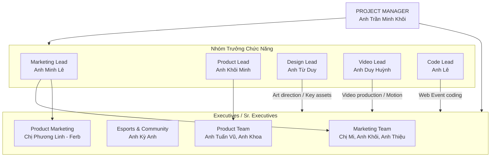

# 📝 Garena FCO Supervisor Briefing Notes

> **Người thực hiện:** Coby (Strategy & Operations - FC Online Team)  
> **Tài liệu gốc:** Supervisor Briefing_Nguyễn Ngọc Phúc.pptx.pdf  
> **Thời gian:** 08/06/2026  
> **Mục tiêu:** Tổng hợp toàn bộ phạm vi công việc, cơ cấu chi tiết đội ngũ FC Online, mục tiêu chiến lược Q3 - Q4 và các nhiệm vụ/kỳ vọng thử việc từ Quản lý trực tiếp.

---

## 1. 💼 Phạm Vi Công Việc (Scope of Work)

Vị trí của bạn được định vị tương đương **Senior Product Specialist / Product Specialist** thuộc bộ phận Product – FC Online. Phạm vi công việc gồm 6 mảng chính với định hướng ứng dụng AI mạnh mẽ:

1.  **Live Ops (Vận hành Game):**
    *   Nắm vững cơ chế game, lên kế hoạch và phát triển hoạt động trên nhiều kênh để thu hút user mới, giữ chân user hiện tại và tái kích hoạt user cũ.
    *   Tạo công cụ/nội dung truyền thông & khuyến mại; thực hiện QA events, sản phẩm và tính năng mới.
    *   *AI Adoption:* Ứng dụng AI tự động hóa quy trình QA, tổng hợp feedback và tối ưu hóa nội dung truyền thông.
2.  **Monetization (Doanh thu):**
    *   Tối ưu hóa doanh thu theo từng phân khúc người chơi (bán hàng/nạp tiền, cải thiện kênh thanh toán, chiến lược định giá).
    *   *AI Adoption:* Dùng AI phân tích hành vi thanh toán của từng nhóm user, đề xuất chiến lược định giá và cá nhân hóa ưu đãi.
3.  **Phối hợp liên phòng ban (Cross-functional):**
    *   Làm việc chặt chẽ với các team Ops, Marketing, Creative và Dev để đảm bảo triển khai hiệu quả các tính năng, campaign và chiến lược.
    *   *AI Adoption:* Dùng AI hỗ trợ soạn thảo brief, tóm tắt họp và theo dõi tiến độ công việc liên team.
4.  **Nghiên cứu thị trường (Market Research):**
    *   Nghiên cứu hành vi user Football, insight người chơi FCO và xu hướng ngành để đề xuất tính năng/campaign mới.
    *   *AI Adoption:* Dùng AI tổng hợp báo cáo thị trường, phân tích đối thủ và phát hiện trend nhanh.
5.  **Tối ưu hiệu suất (Performance Optimization):**
    *   Theo dõi và tối ưu campaign bằng A/B testing để đạt ROI tối đa. Đề xuất/phát triển tính năng/công cụ mới hỗ trợ vận hành.
    *   *AI Adoption:* Dùng AI tự động phân tích kết quả A/B test, phát hiện insight từ dữ liệu và đưa ra khuyến nghị.
6.  **Báo cáo (Reporting):**
    *   Chuẩn bị báo cáo chi tiết về hiệu suất campaign, chỉ số thu hút user và đề xuất chiến lược gửi stakeholders.
    *   *AI Adoption:* Dùng AI tự động hóa tổng hợp dữ liệu, tạo báo cáo và trực quan hóa số liệu.

---

## 2. 🏢 Cơ Cấu Tổ Chức Chi Tiết FCO Team (Vietnam)

Cả team hoạt động chủ yếu qua **SeaTalk-app** làm kênh trao đổi thông tin chính.

### Chi tiết phân công công việc các Executive:
*   **Marketing Team (Mi, Khôi, Thiệu):** Quản lý KOLs, các chiến dịch Marketing lớn (Big Campaigns), tổ chức sự kiện lớn và các task MKT khác.
*   **Esports & Community Team (Kỳ Anh):** Vận hành giải đấu Esports, sản xuất chương trình giải đấu, quản lý giải đấu Cyber/Student Cup, tổ chức sự kiện cộng đồng online/offline, quản lý các group cộng đồng.
*   **Product Team (Tuấn Vũ, Khoa):** Lên kế hoạch sản phẩm & setup in-game, quản lý Live Ops.
    *   *Anh Tuấn Vũ:* Phụ trách phát triển doanh số web sự kiện (Web Revenue development) & Revenue content.
    *   *Anh Khoa:* Phụ trách phát triển truy cập web (Web DAU development).
*   **Product Marketing Team (Phương Linh - Ferb):** Hoạch định chiến lược Marketing sản phẩm dài hạn (Long-term product planning), chạy Product Campaigns.
*   *Lưu ý: Dưới mỗi bạn Sr. Executive / Executive sẽ có từ 1 - 2 bạn Cộng tác viên (CTV) hỗ trợ thực hiện dự án.*

---

## 3. 🎯 Mục Tiêu Đội Ngũ FC Online (Goals & Objectives Q3 - Q4)

### 1. Duy trì Activeness & Giữ chân người chơi sau World Cup (Retention)
*   **Retention sau World Cup (Q3 - Q4):** Theo dõi & phân tích hành vi user sau World Cup để triển khai các hoạt động retention, giảm churn rate và duy trì activeness ổn định trong giai đoạn game PC thấp điểm.
*   **Engagement mùa hè (Q3):** Lên kế hoạch các sự kiện DAU-driven, hoạt động tương tác gameplay và web events nhằm giữ CCU/MAU ổn định.
*   **Live Ops ổn định (Q3):** Đảm bảo vận hành mượt mà các mùa thẻ, event và hệ thống game trong giai đoạn hè và hậu World Cup.
*   **Ra mắt VIP System (Q3 - Q4):** Kết hợp DAU & Pay tạo động lực chơi game dài hạn thông qua progression, loyalty rewards và đặc quyền theo thời gian hoạt động/nạp.

### 2. Tối ưu hóa Doanh thu & Gia tăng giá trị Paying Users (Monetization)
*   **Roadmap Mùa Thẻ Infinity Prime (Q3):** Xây dựng roadmap vận hành và định vị (positioning) cho thẻ Infinity Prime nhằm tạo progression dài hạn và giá trị sưu tầm cho user.
*   **Kiểm soát Sentiment (Q3):** Tối ưu chỉ số gameplay, economy và user sentiment trong giai đoạn launch Infinity Prime nhằm hạn chế negative feedback.
*   **Revenue Performance (Q3 - Q4):** Tối ưu hóa các gói khuyến mại (sales packages) và nhịp độ sự kiện (event pacing) dựa trên phân tích doanh thu tuần/tháng.
*   **Tool TTCN (Q3):** Phát triển công cụ theo dõi/report giá cầu thủ trên Thị trường chuyển nhượng để kiểm soát biến động giá và đảm bảo giá trị cầu thủ.

### 3. Vận hành Sản phẩm dựa trên Dữ liệu (Data-driven Ops)
*   **Feedback Loop (Q3 - Q4):** Thiết lập quy trình phân tích feedback người chơi từ kênh CS, community và social để phát hiện sớm pain points.
*   **Auto Reporting (Q3 - Q4):** Xây dựng hệ thống báo cáo tự động (DAU, MAU, retention, revenue, event performance) để tăng tốc độ phản ứng của team.

### 4. AI Adoption (Q3 - Q4)
*   Phát triển các công cụ nội bộ hỗ trợ Live Ops / Product team dự báo hiệu suất (performance forecasting) và theo dõi hiệu quả sự kiện (event tracking).

---

## 4. 🚀 Nhiệm Vụ & Kỳ Vọng Thử Việc (Probation Projects & Expectations)

### 🎯 3 Nhiệm Vụ Thử Việc Chuyên Môn Chi Tiết:

#### 1. Phát triển trang VIP từ định hướng ban đầu
*   **Mô tả công việc:**
    *   *GIAI ĐOẠN 1 – Tìm hiểu & QA/Test (Tuần 1–4):* Tìm hiểu định hướng đã có sẵn của trang VIP (cấu trúc, tính năng, đối tượng mục tiêu). Tham gia với vai trò tester/QA: kiểm tra tính năng, phát hiện bug, ghi nhận feedback trải nghiệm user. Đóng góp ý kiến cải thiện UX/UI và nội dung trước khi trang launch (dự kiến sau tháng đầu thử việc).
    *   *GIAI ĐOẠN 2 – Theo dõi sau launch & đề xuất upgrade (Tuần 5–8):* Theo dõi phản hồi từ user VIP sau khi trang ra mắt. Tổng hợp insight, đề xuất các hạng mục cần upgrade trong roadmap 3–6 tháng tiếp theo (nếu cần).
*   **Lịch trình:** Tuần 1–4 (Tìm hiểu & QA/Test) | Tuần 5–8 (Theo dõi sau launch & đề xuất upgrade).
*   **Tác động:** Đảm bảo trang VIP launch với chất lượng tốt, không có lỗi critical. Đóng góp góc nhìn người dùng thực tế vào quá trình hoàn thiện trang. Xây dựng nền tảng hiểu biết về VIP user để hỗ trợ các quyết định nâng cấp sau này.
*   **Kỳ vọng đầu ra (KPI/Đánh giá):**
    *   *Trước launch (Tuần 1–4):* Hoàn thành checklist QA, ghi nhận đầy đủ bug và feedback UX trước ngày trang đi live. Có ít nhất 2 đóng góp ý kiến cải tiến được team ghi nhận.
    *   *Sau launch (Tuần 5–8):* Tổng hợp feedback user VIP sau launch. Có bản đề xuất hạng mục upgrade 3–6 tháng (nếu cần) trước khi kết thúc thử việc.

#### 2. Tối ưu doanh thu (Data-driven)
*   **Mô tả công việc:**
    *   *GIAI ĐOẠN 1 – Tìm hiểu & phân tích data (Tuần 1–3):* Nghiên cứu quy trình thực hiện một monetize web event (từ ý tưởng $\rightarrow$ approve $\rightarrow$ launch). Phân tích data các web event cùng tier đã ra mắt: hành vi user, tỷ lệ tham gia, revenue, các điểm drop-off. Từ data, xác định insight rõ ràng: user thích loại quà nào, mechanic nào hiệu quả, khung giá nào tối ưu. Hoàn thiện 1 bản plan 1 trang (one-pager): tóm tắt insight từ data + đề xuất hướng thiết kế sự kiện.
    *   *GIAI ĐOẠN 2 – Thiết kế, thực thi & launch (Tuần 4–8):* Dựa trên data insight, lên ý tưởng và đề xuất quà, mechanic, định giá phù hợp với hành vi user. Draft nội dung, phối hợp Creative/Dev xây dựng trang sự kiện. QA trang web event, đảm bảo 0 lỗi critical trước khi launch. Launch, theo dõi kết quả và đối chiếu với dự báo ban đầu từ data.
*   **Lịch trình:** Tuần 1–3 (Phân tích data & lên plan) | Tuần 4–8 (Thiết kế, QA & launch).
*   **Tác động:** Rèn tư duy data-driven (mọi quyết định thiết kế sự kiện đều có data back-up). Giúp nhân sự hiểu rõ hành vi user và cách chuyển insight thành sản phẩm thực tế. Đóng góp trực tiếp vào doanh thu team qua 1 web event được thiết kế có căn cứ.
*   **Kỳ vọng đầu ra (KPI/Đánh giá):**
    *   *Tuần 1–3:* Hoàn thành 1 one-pager chứa ít nhất 3 insight rõ ràng từ data + đề xuất hướng thiết kế sự kiện có căn cứ.
    *   *Tuần 4–8:* Trang web event launch đúng tiến độ, 0 lỗi critical ảnh hưởng user. Doanh thu (revenue) tổng sự kiện không chênh lệch quá nhiều so với các monetize web event cùng tier (benchmark $\pm15\%$). Có bản đối chiếu kết quả thực tế vs. dự báo từ data sau khi sự kiện kết thúc.

#### 3. Phân tích dữ liệu (Data & Retention)
*   **Mô tả công việc:**
    *   *GIAI ĐOẠN 1 – Phân tích & xác định pain point (Tuần 1–4):* Thu thập và phân tích data hành vi user: tỷ lệ churn, điểm drop-off, session frequency, nhóm user nguy cơ cao. Ứng dụng AI tools để hỗ trợ xử lý data, tìm pattern, phân khúc user và rút ra insight nhanh hơn. Xác định top 2–3 pain point ảnh hưởng trực tiếp đến activeness và retention. Đề xuất hypothesis: vấn đề cốt lõi là gì, giải pháp tiềm năng nào có thể giải quyết.
    *   *GIAI ĐOẠN 2 – Thiết kế & triển khai campaign (Tuần 5–8):* Dựa trên insight từ data, thiết kế concept campaign nhắm trực tiếp vào pain point đã xác định. Dùng AI để hỗ trợ viết message, cá nhân hoá nội dung theo từng nhóm user, và tối ưu channel strategy. Phối hợp MKT team lên kế hoạch thực thi: message, channel, target audience, timing. Launch campaign hoặc hoàn thiện bản kế hoạch sẵn sàng launch. Đo lường kết quả ban đầu và đề xuất hướng tối ưu tiếp theo.
*   **Lịch trình:** Tuần 1–4 (Phân tích data & xác định pain point) | Tuần 5–8 (Thiết kế & triển khai campaign với MKT).
*   **Tác động:** Rèn kỹ năng đọc và diễn giải data thành hành động cụ thể. Đóng góp trực tiếp vào cải thiện chỉ số retention và activeness của sản phẩm. Phát triển kỹ năng cross-functional (phối hợp Product và MKT team).
*   **Kỳ vọng đầu ra (KPI/Đánh giá):**
    *   *Tuần 1–4:* Bản phân tích data xác định rõ ít nhất 2–3 pain point chính, kèm hypothesis giải pháp. Có ít nhất 1 ví dụ cụ thể về việc dùng AI hỗ trợ phân tích (phân khúc user, tìm pattern, v.v.).
    *   *Tuần 5–8:* Bản kế hoạch campaign đầy đủ (concept, target audience, channel, KPI dự kiến) được quản lý approve. Nếu campaign launch trong thời gian thử việc: có số liệu đo lường activeness / churn rate so với baseline.

### 🌟 Kỳ vọng ngoài chuyên môn (Mục tiêu bắt buộc):
*   **Hiểu game & người dùng:** Nghiêm túc chơi FC Online ở tần suất cao (**2 - 3 tiếng / ngày**). Đảm bảo hiểu rõ core gameplay, định vị sản phẩm, hành vi khách hàng, cách thức bán hàng và các chương trình khuyến mãi. **Quyết tâm trở thành hard-core gamer của FC Online**.
*   **Thái độ tích cực:** Luôn đúng giờ, đúng hạn commit, chủ động đảm bảo tiến độ & cập nhật thường xuyên với quản lý trực tiếp.
*   **Giao tiếp & Phối hợp:** Trình bày kế hoạch thuyết phục, tự tin phản hồi feedback từ stakeholders. Chủ động phối hợp làm việc.
*   **Stay Alert (Trực tuyến ngoài giờ):** Không yêu cầu online 24/7, nhưng khi có sự cố ảnh hưởng tới vận hành sản phẩm thì bắt buộc phải stay alert và sẵn sàng giải quyết/hỗ trợ xử lý sự cố.
*   **Sáng tạo:** Đề xuất ít nhất **1 ý tưởng hoặc cải tiến** trong 2 tháng thử việc liên quan đến các công việc đang làm.
*   **Tinh thần chủ động đóng góp:** Quan sát nhu cầu của user hoặc các vấn đề trong cách vận hành để đưa ra đề xuất cho team Product Ops và FCO.

---

## 5. 📞 Liên Hệ Hỗ Trợ & Khẩn Cấp

### 1. Đầu mối liên hệ khẩn cấp ngoài giờ (Critical Issues Only):
Nếu xảy ra sự cố critical liên quan đến sản phẩm hoặc logic web sự kiện phát sai quà, phải liên hệ bằng mọi giá kể cả nửa đêm:
*   **Anh Trần Minh Khôi (PM FCO):** (+84) 989888105 (Quyết định khẩn cấp / Sự cố Product & Web).
*   **Anh Minh Lê (Marketing Lead):** (+84) 938762212 (Quyết định khẩn cấp liên quan tới Marketing).
*   **Anh Minh Từ (Design Lead):** (+84) 901068725 (Hỗ trợ khẩn cấp liên quan tới Design).
*   **Anh Duy Huỳnh (Video Lead):** (+84) 909384826 (Hỗ trợ khẩn cấp liên quan tới Video).

### 2. Các đầu mối liên hệ nội bộ (Cập nhật):
*   **People Services [HN]:** Ms Thu Trang (thutrang.pham@garena.vn) & Ms Thu Ba (thuba.dinh@garena.vn).
*   **C&B:** Ms Mỹ Hạnh (myhanh.luu@garena.vn) & Ms Ngọc Trâm (ngoctram.nguyen@garena.vn).
*   **IT Support [HCM]:** Mr Tuấn (quangtuan.vu@shopee.com) & Mr Duy Phương (duyphuong.ngo@shopee.com).
*   **Dev (Engineering):** Mr Phúc (dinhphuc.luu@garena.vn) & Mr Kiên (trungkien.tran@garena.vn).
*   **Procurement (Purchase):** Ms Chinh (tuyenchinh.vo@garena.vn).
*   **Admin Game (Vendor Ops):** Ms Hồng Hạnh (honghanh.nguyen@garena.vn).
*   **Legal:** Ms Lê (hoangle.ha@sea.com).

### 3. Các platform chính của FCO:
1. FB Official Page: FC Online VN
2. YT Official Channel: FC Online VN
3. Web Official: FC Online VN
4. FB Group: FC Online VN
5. TikTok Channel: FC Online Viet Nam
6. Group các cộng đồng tỉnh/sinh viên
7. Các kênh KOL FC Online VN
