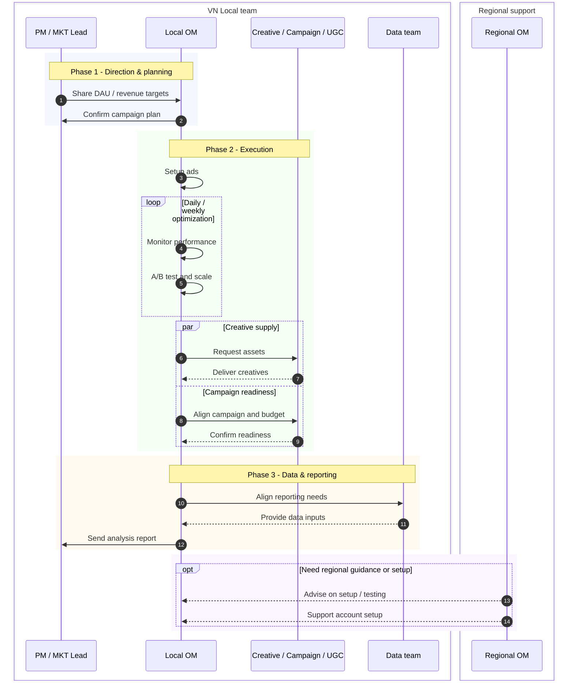
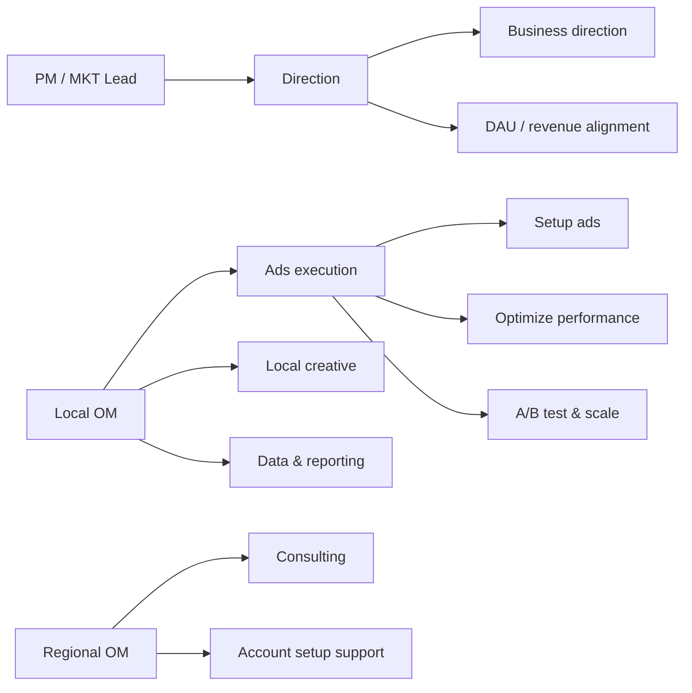
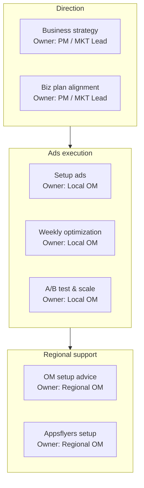

# Diagram Patterns

Use these templates as starting points. Adapt labels to the Outline page, and keep Mermaid code smaller than the source table.

## Sequence: Operating Flow With Local And Regional Support

Use when the page describes a workflow after a local team takes ownership, with regional support only when needed.

## Flowchart: Owner Map

Use when the page needs a quick owner-first view. Keep this high-level; do not include every task if it makes the graph too wide.

## Flowchart: Workstream Buckets

Use when workstreams matter more than people. Put owners inside nodes instead of drawing too many cross-links.

## RACI-Lite Table For Outline

When ownership ambiguity matters, add a small table after the diagram. Use this instead of making the diagram carry all responsibility detail.

| Workstream | Accountable | Responsible | Consulted |
| --- | --- | --- | --- |
| Direction | PM / MKT Lead | PM / MKT Lead | Local OM |
| Ads execution | Local OM | Local OM | Regional OM |
| Data reporting | Local OM | Local OM + Data team | PM / MKT Lead |
| Regional setup support | Regional OM | Regional OM | Local OM |

## Review Checklist

- Can a PM understand the diagram in 30 seconds?
- Does the title say what question the diagram answers?
- Are support paths marked as optional when they are not part of the main flow?
- Are recurring tasks represented as `loop` instead of many repeated arrows?
- Are parallel tasks represented as `par` instead of a misleading strict sequence?
- Is the raw source table preserved below the diagram?
